# Local Chat App

Local Chat App is a local-first chat archive for AI conversations. It stores conversations as readable JSON files, provides a small web UI, packages as an Electron desktop app, and includes a browser extension that can capture messages from supported AI chat sites into the local archive.

The project is designed for private local use, not as a hosted multi-user service.

## What it does

- Creates, edits, searches, pins, exports, restores, and deletes local chat sessions.
- Provides a centered chat-search dialog with recent conversations, indexed message snippets, and highlighted matches.
- Adds a right-side in-chat navigator with one marker per user message and hover/focus previews for quick jumps through long conversations.
- Adds per-message copy, edit, and delete quick actions with icon tooltips while keeping the existing text actions in the message header.
- Renders fenced code blocks with a copy control and a language label when the fence declares one; common C++ fence aliases are displayed as `c++`.
- Stores each chat as a JSON file grouped by date under a local data directory.
- Provides a browser extension for saving prompts and completed AI responses from AI chat UIs.
- Supports ChatGPT, Claude, DeepSeek, and Gemini through best-effort DOM adapters.
- Runs as either a Node/Express web app or a packaged Electron desktop app.

## Screenshots

A quick look at the local web app and browser-extension capture flow.

### Local app

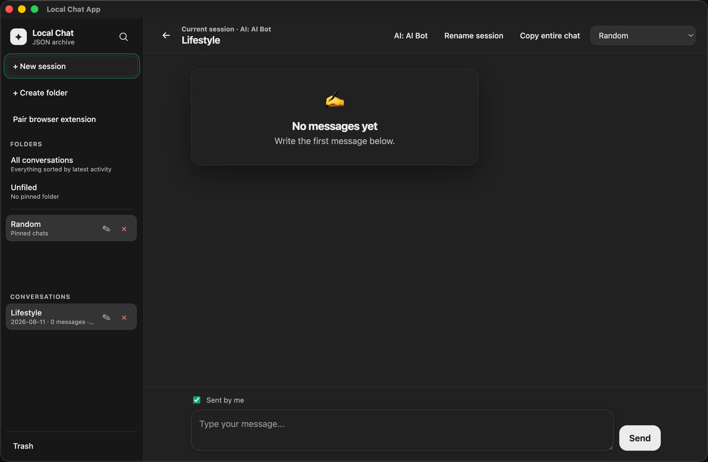

<p align="center">
  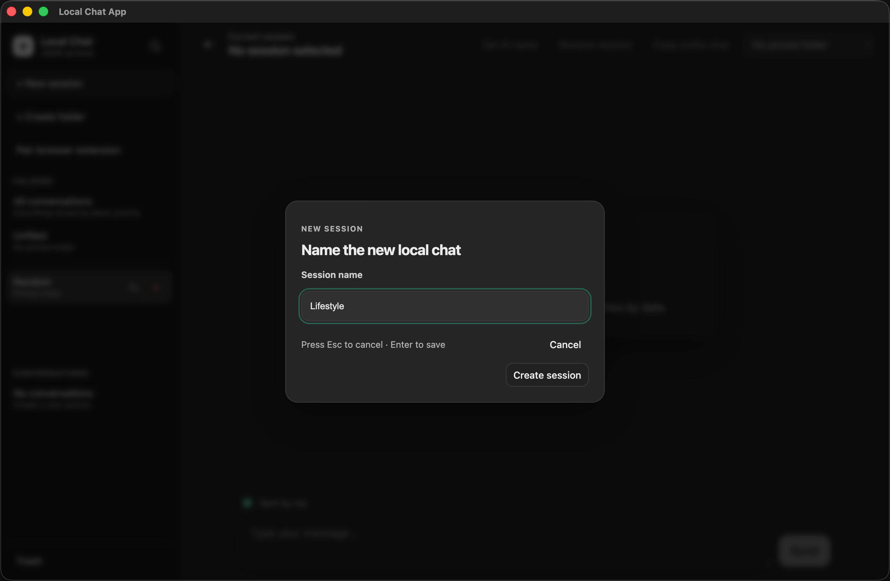
  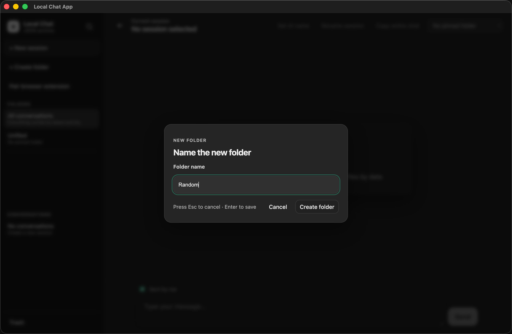
</p>

<p align="center">
  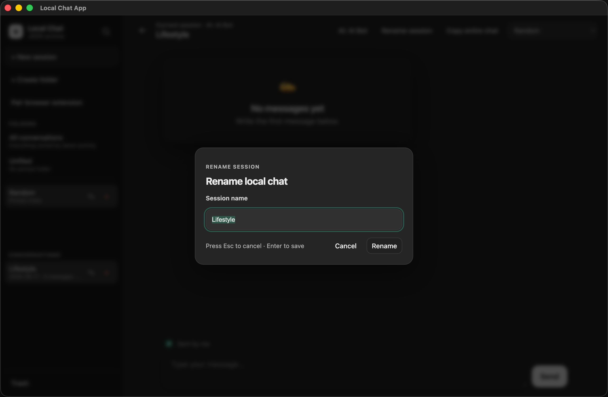
  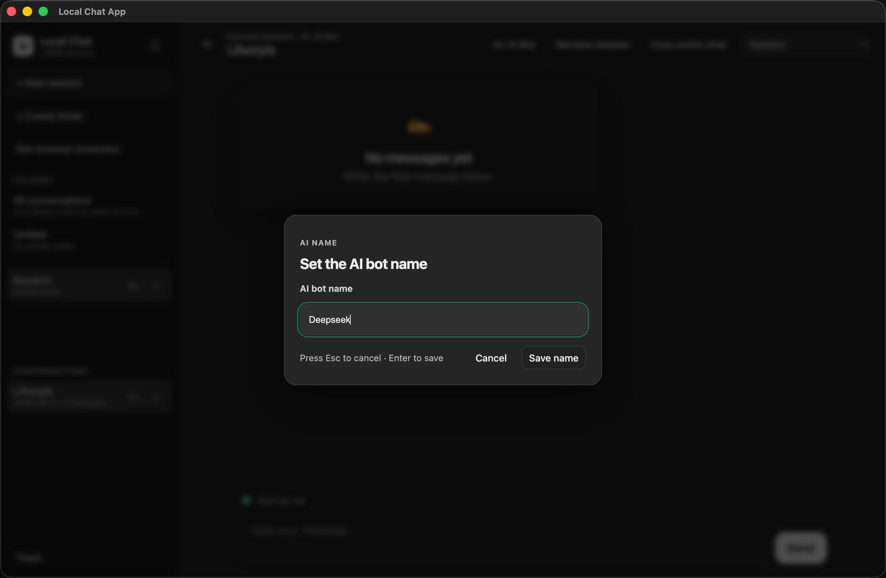
</p>


<p align="center">
  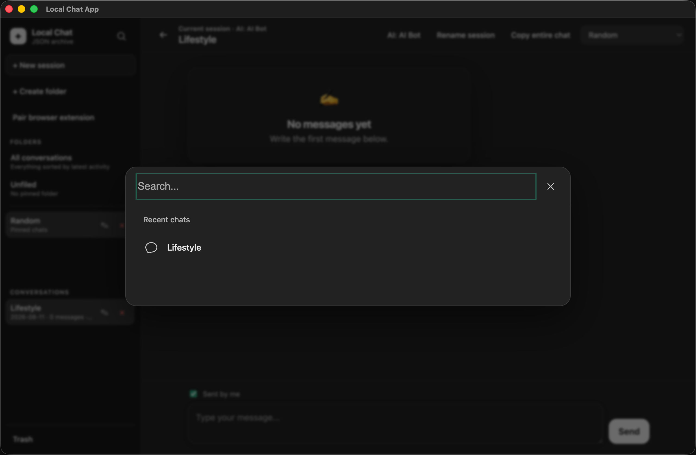
  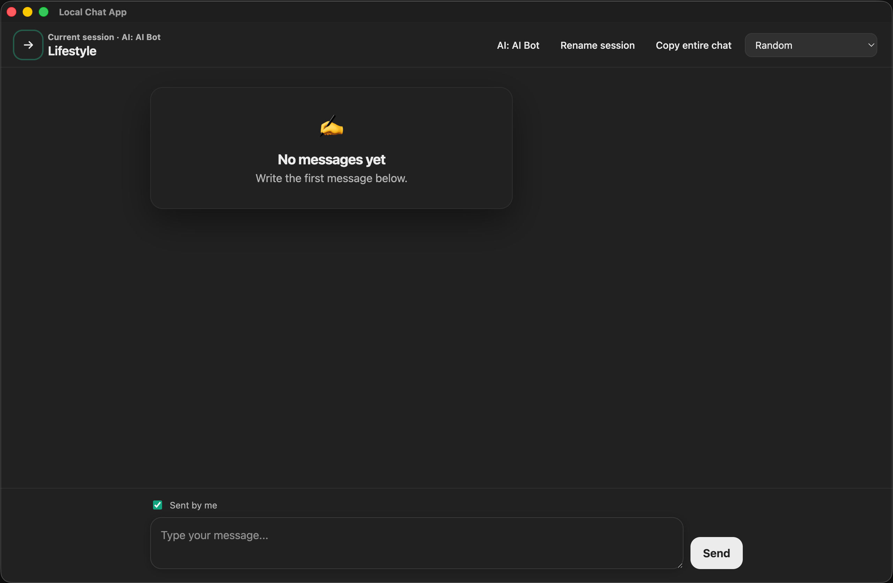
</p>

### Browser extension on supported providers

<p align="center">
  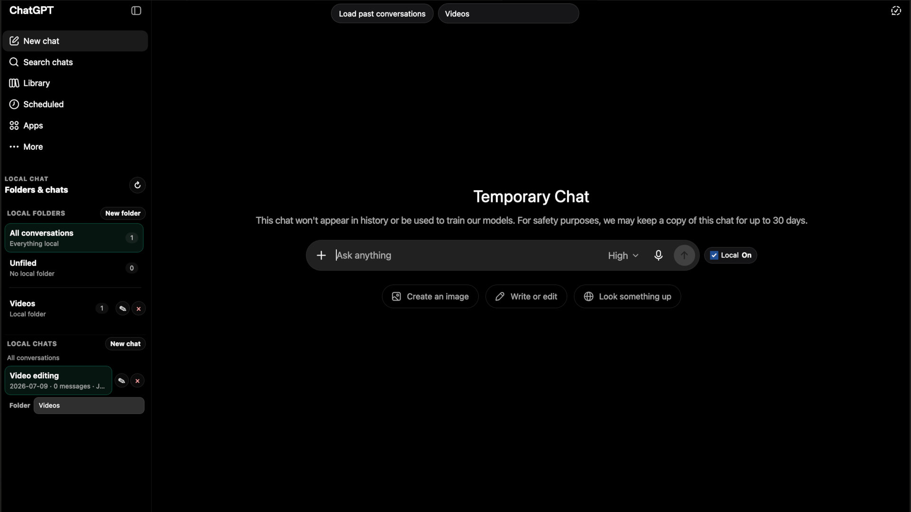
  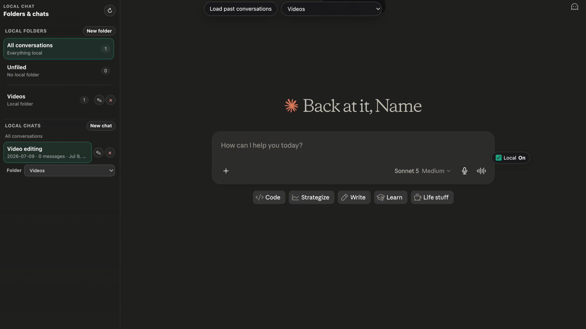
</p>

<p align="center">
  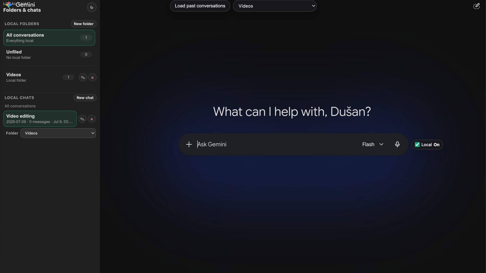
  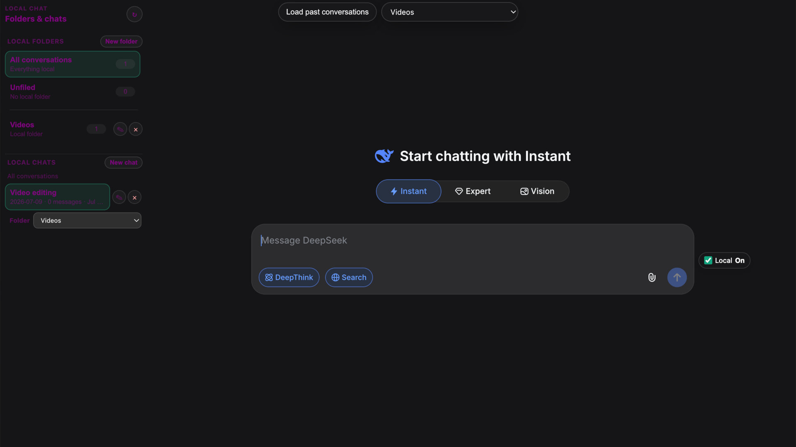
</p>

## Architecture

```text
browser-extension/        Browser extension UI, content-script modules, provider adapters, and background worker
public/                   Local web UI served by Express, split into native ES modules under public/app/
server.js                 Small server bootstrap / public module exports
src/server/               Express app, routes, services, storage, validation, and security middleware
electron/                 Desktop shell around the same local server
test/                     Node, jsdom, and Playwright tests for API, storage, extension, and web UI flows
docs/                     Architecture, security, and API notes
```

Runtime data is intentionally excluded from git. By default Node mode writes to `./data`; Electron mode writes to the OS-specific app data directory.

## Quick start

```bash
npm ci
npm start
```

Open:

```text
http://127.0.0.1:3000
```

For desktop mode:

```bash
npm run desktop
```

## Browser extension setup

1. Start the local app.
2. Open Chrome or another Chromium browser.
3. Go to `chrome://extensions`.
4. Enable Developer mode.
5. Click **Load unpacked**.
6. Select the `browser-extension/` folder.
7. In Local Chat App, click **Pair browser extension** and generate a short-lived code.
8. Open the extension popup, confirm the local app URL, enter the pairing code, and click **Pair**.

The extension communicates with the local API only through its background worker. Pairing binds a generated token to the browser extension ID; the server stores only a SHA-256 token hash. Pairing is the normal browser-extension setup. `LOCAL_CHAT_AUTH_TOKEN` remains a server-side compatibility fallback for API clients that already provide the required extension headers, while `LOCAL_CHAT_EXTENSION_IDS` can optionally restrict which extension IDs may pair or use that fallback.

## Security model

The app is local-first and binds to `127.0.0.1` by default. The API rejects untrusted browser origins, requires browser-extension pairing, validates route IDs, writes JSON atomically, and uses per-file write locks for read-modify-write flows. The Electron shell blocks unexpected navigation and child windows, allowlists external URL schemes, serves the UI with restrictive browser security headers, and waits for the local HTTP server to close during shutdown.

Important remaining assumptions:

- This is still a single-user localhost app.
- Do not expose the port to a LAN or the internet.
- Browser-extension capture depends on third-party website DOM structures, which can break without notice. The extension popup includes a privacy-preserving provider diagnostic report to surface selector/extraction degradation without exposing conversation text.
- JSON-file storage is inspectable and portable. Routine list/recent/search operations use a derived `.session-index.json` cache, but the canonical chat files remain the source of truth. The index can be deleted and rebuilt safely.

See [`docs/SECURITY.md`](docs/SECURITY.md) for details.

For large archives, the server maintains a private derived session index containing summary metadata, filesystem signatures, and a fixed-size Bloom search projection. Normal in-app writes invalidate only the affected session entry; a periodic full reconciliation catches out-of-band edits. Long search queries use the Bloom projection to discard non-candidate sessions before reading canonical transcripts, while queries shorter than three characters deliberately fall back to exact full-file scanning so search behavior does not change. Session/recent/search APIs also support offset pagination and conditional `ETag` revalidation; the web UI and extension reuse cached GET bodies after `304 Not Modified` responses, and paginated exact search stops once it has filled the requested window plus one look-ahead match.

## Verification

```bash
npm run verify
npm run test:coverage
```

`npm run verify` runs ESLint, Prettier format checks, recursive syntax checks across `server.js`, `src/server/`, the native-ES-module web UI, shared markdown renderer, extension scripts, Electron entrypoint, the Node/jsdom test suite, a Playwright smoke test against a live local server, and a packaged-Electron launch smoke test built with `electron-builder --dir`. The tests cover API/session/folder/message/trash flows, origin/token security behavior, concurrent JSON writes, message idempotency, markdown rendering/sanitization, code-block copying, the chat-search modal, the in-chat message navigator, per-message quick actions, web UI API/render/controller/event seams, a browser-level jsdom flow through the real web UI runtime, the single module entrypoint, extension background API calls, provider-adapter resolution, content-script DOM fixture extraction/injection plus mutation-resistance and diagnostics for ChatGPT, Claude, DeepSeek, and Gemini, autosave behavior, local sidebar replacement behavior, composer/load-past modal behavior, runtime auto-send/availability/Save local behavior, keyboard focus behavior for dialogs, accessible names/state, live status announcements, and browser-level accessibility invariants.

Additional quality-gate commands:

```bash
npm run lint
npm run format:check
npm run test:smoke
npm run test:smoke:optional
npm run test:electron-smoke
npm run benchmark:index -- 1000
```

`npm run test:smoke` requires Playwright/Chromium and fails when the browser is unavailable, so `npm run verify` cannot silently pass without browser coverage. In CI, Chromium is installed with `npx playwright install --with-deps chromium` and the full verification command runs under `xvfb-run` so the packaged Linux Electron window has a display. Locally, Playwright can also use a system Chromium via `PLAYWRIGHT_CHROMIUM_EXECUTABLE`. Use `npm run test:smoke:optional` only for lightweight local checks where a missing Playwright browser is allowed to skip the smoke test. The required web smoke flow also checks accessible control names, ARIA references/state, dialog focus containment/restoration, chat-search focus/close behavior, message-action hover transitions, and dynamic UI accessibility after session/trash operations. `npm run test:electron-smoke` builds an unpacked production package, launches its real executable through Playwright Electron automation, verifies `app.isPackaged`, ASAR loading, BrowserWindow hardening, local-server/security headers, blocked navigation/window creation, and graceful port release on quit.

## Build desktop packages

```bash
npm run build:desktop
```

Platform-specific commands:

```bash
npm run build:mac
npm run build:win
```

See [`DESKTOP_BUILD.md`](DESKTOP_BUILD.md).

## Known limitations

- The extension uses DOM heuristics for AI chat sites. Provider UI changes may require adapter updates; use **Diagnose page** in the popup to inspect adapter health without sending conversation text.
- The browser content-script has been split into tested modules: provider adapters live in `browser-extension/providers/*`, shared extraction lives in `content-dom.js`, clipboard/manual message extraction lives in `content-message-save.js`, autosave state/scheduling lives in `content-autosave.js`, local sidebar replacement lives in `content-sidebar.js`, composer/load-past modal behavior lives in `content-composer.js`, and Save local injection plus local-app availability / auto-save toggle coordination lives in `content-runtime.js`. `content.js` is now mostly the bootstrap/coordinator that wires these modules together.
- The frontend is intentionally vanilla JavaScript and uses a single native ES module entrypoint at `public/app/main.mjs`. Browser code is split into `api.mjs`, `state.mjs`, `render.mjs`, `message-navigator.mjs`, `modals.mjs`, `clipboard.mjs`, `events.mjs`, `export.mjs`, and `markdown.mjs` without a bundler. `controllers.mjs` is only a controller composition root; domain behavior lives under `public/app/controllers/` in session, folder, message, active-session, and search modules.
- Content-script fixture tests now cover provider extraction, Save local injection, mutation resistance, and privacy-preserving adapter diagnostics for ChatGPT, Claude, DeepSeek, and Gemini. Autosave unit tests cover idempotency-key generation, armed assistant-target saves, and outgoing prompt dedupe. Sidebar fixture tests cover local folder/session rendering, session selection, refresh behavior, and native-sidebar hide/restore. Composer tests cover composer detection, transcript insertion, pasted-text attachment fallback behavior, modal search/rendering, local export loading, and top active-folder controls. Manual-save tests cover selected-text preference, provider clipboard capture/restoration, DOM fallback, and visible-message filtering. Runtime tests cover auto-send toggle persistence, local-app unavailability cleanup, Save local delegation, and health-check/save coordination. Web UI module tests cover the API client, renderer escaping/filtering, markdown rendering integration, session/message controllers, labelled controls, live status output, modal focus containment/restoration, delegated events, and the native ES module entrypoint. Browser-level jsdom integration tests boot the real `createRuntime`, click actual UI controls/modals, exercise fake API-backed folder/session/message creation, rename, trash, and restore flows, and assert DOM/state updates. A Playwright smoke test starts the real Express server with an isolated temp data directory, opens the actual web UI in Chromium, creates a folder/session/message, renames, trashes, restores, and verifies persisted API state. Provider fixtures remain reduced fixtures rather than live-site E2E tests, so provider UI changes can still require adapter updates.

## Contributing

See [`CONTRIBUTING.md`](CONTRIBUTING.md) for the development workflow, quality gates, architecture expectations, and the provider-adapter checklist.

## Repository hygiene

Do not commit runtime chats, OS metadata, build outputs, secrets, or dependencies. The repo includes `.gitignore` rules for these files.

## License

ISC. See [`LICENSE`](LICENSE).
